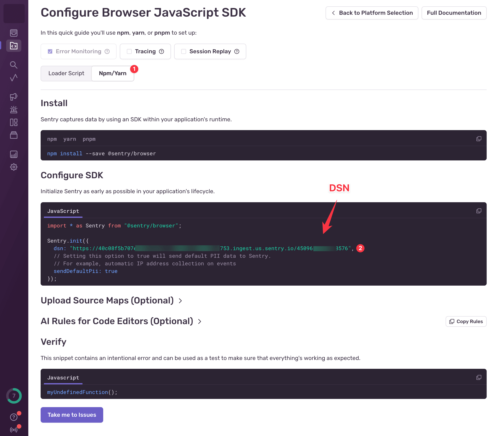
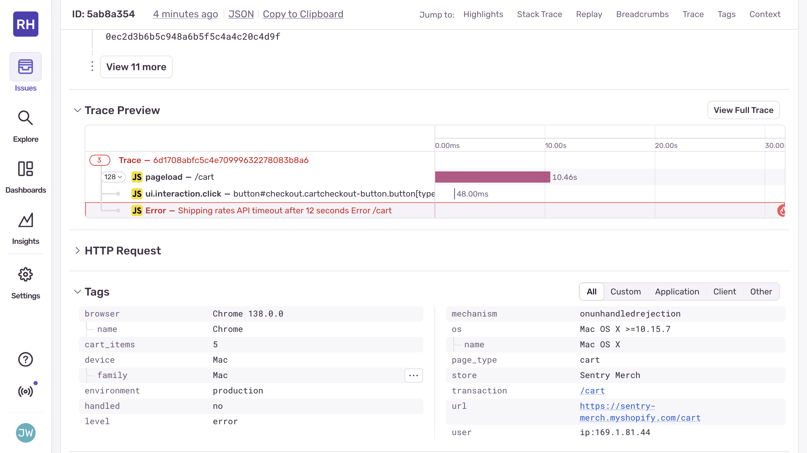

# Using Sentry session replay to debug ecommerce performance issues

When customers abandon their shopping carts or complain about checkout problems, traditional error logs leave you guessing about what actually happened. You might see a "payment timeout" error in your logs, but did the user wait patiently for 30 seconds, or did they rage-click the checkout button dozens of times before giving up? Understanding this difference is crucial for fixing the right problem.

This is where session replay technology transforms ecommerce debugging. Session replay gives you the "what" and "when" by showing exactly what users experienced during errors and performance issues. Performance monitoring provides the "how slow" and "where in the code" with precise timing data and traces. Error tracking delivers the "why it broke" with complete stack traces and breadcrumbs. When these capabilities work together in a unified platform like Sentry, you get complete context about ecommerce issues without jumping between different replay and monitoring solutions to piece everything together.

Traditional debugging approaches force you to correlate data across multiple tools. You might use one tool for website session recording, another for performance monitoring, and a third for error tracking. Sentry's integrated approach means user session replay, performance data, and error information are automatically linked, giving you the full story when users encounter problems during their shopping experience.

Session replay captures and recreates user interactions on your website, creating a video-like recording of exactly what users see and do. In ecommerce applications, this technology helps you understand user behavior during critical moments like product searches, cart additions, and checkout processes. Unlike traditional analytics that show aggregate data about user actions, browser session replay software lets you watch individual user journeys that led to specific problems.

The advantages of replay become clear when combined with performance monitoring and error tracking. A slow API call might show up in your performance metrics, but session replay shows you how users react to that slowness. Modern rum session replay tools also respect user privacy by automatically masking sensitive information like payment details and personal data.

## Setting up comprehensive monitoring in your Shopify environment

We'll demonstrate Sentry's unified monitoring capabilities using a Shopify store with realistic ecommerce functionality. This setup process shows you how to integrate [session replay](https://sentry.io/product/session-replay/) with performance monitoring and error tracking while capturing the context needed for effective debugging.

### Setting Up Sentry

To add Sentry monitoring to your Shopify store, follow these steps:

1. Sign up for a [Sentry account](https://sentry.io).

2. Create a new project by clicking **Create Project**.

3. Choose **Browser JavaScript** as your platform, and give your project a name like "Shopify Store Monitoring". Click **Create Project** and then **Configure SDK** when prompted.


4. After creating the project, Sentry will provide you with a data source name (DSN), a unique identifier that tells the Sentry SDK where to send events from your Shopify store.



We will use this DSN in the next section when integrating the Sentry SDK into the Shopify theme to enable session replay, performance monitoring, and error tracking for your ecommerce application.

### Setting Up Shopify

To demonstrate Sentry's session replay capabilities in a realistic ecommerce environment, we will set up a Shopify development store.

1. **Create a Shopify Partner account** at [partners.shopify.com](https://partners.shopify.com) if you don't already have one. Partner accounts let you create unlimited development stores for testing without monthly fees.

2. **Create a new development store** by clicking "Stores" in your Partner dashboard, then "Add store". Choose "Development store" and select "Create a store to test and build" as your purpose.

3. **Create your store** after giving it a name, click **Create Development Store**.


3. **Install your store theme.** Navigate to "Online Store" then "Themes" in your Shopify admin panel. Install the Horizon theme to follow along with this guide. Once you have added this theme, click **Publish**.


4. **Get the store password** by clicking **See store password**. The store requires a password while in development mode.

5. **Add sample products** with different price points to create realistic shopping scenarios. Navigate to "Products" then "Add product" and create a demo product, and click **Save**.


### Integrate Sentry into your Shopify Theme

In your Shopify admin, navigate to "Online Store" then "Themes". Click the three dots on your active theme, then "Edit code". 

Open the `layout/theme.liquid` file and add the Sentry SDK to the `<head>` section, before `{{ content_for_header }}`.

```html
<script
  src="https://browser.sentry-cdn.com/9.40.0/bundle.tracing.replay.feedback.min.js"
  integrity="sha384-Pe41llaXfNg82Pkv5LMIFFis6s9XOSxijOH52r55t4AU9mzbm6ZzQ/I0Syp8hkk9"
  crossorigin="anonymous"
></script>

<script>
  Sentry.onLoad(function() {
    Sentry.init({
    dsn: "YOUR_DSN_HERE",
      initialScope: {
        tags: {
          store: "{{ shop.name }}",
          page_type: "{{ template.name }}"
        },
        user: {
          
            id: "{{ customer.id }}",
            email: "{{ customer.email }}",
          
        },
        contexts: {
          page: {
            template: "{{ template.name }}",
            url: "{{ canonical_url }}"
          }
        }
      },
      
      tracesSampleRate: 1.0,
      replaysSessionSampleRate: 1.0,
      replaysOnErrorSampleRate: 1.0,

      tracePropagationTargets: ["localhost", /^https?:\/\//],
      
      integrations: [
        Sentry.feedbackIntegration({
          colorScheme: "system",
          enableScreenshot: true,
          showBranding: false,
          showName: true,
          showEmail: true,
          isRequiredEmail: true,
        }),
        Sentry.replayIntegration(),
        Sentry.browserTracingIntegration()
      ],
      
      beforeSend(event) {
        if (typeof window !== 'undefined' && window.cart) {
          event.contexts = event.contexts || {};
          event.contexts.cart = {
            item_count: window.cart.item_count || 0,
            total_price: window.cart.total_price || 0,
            currency: "{{ cart.currency.iso_code }}"
          };
        }
        return event;
      }
    });
    
    document.addEventListener('DOMContentLoaded', function() {
      Sentry.setTag('cart_items', {{ cart.item_count }});
      Sentry.setContext('store_info', {
        currency: "{{ cart.currency.iso_code }}",
        locale: "{{ request.locale.iso_code }}"
      });
    });
  });
</script>
```

Replace `YOUR_DSN_HERE` with your actual Sentry project DSN. This configuration sets up three essential monitoring capabilities for your ecommerce store:

**Session Replay**: The `replaysSessionSampleRate: 1.0` and `replaysOnErrorSampleRate: 1.0` settings capture 100% of user sessions so every error is accompanied by session replay data.

**Performance Monitoring**: The `tracesSampleRate: 1.0` setting enables performance monitoring for all transactions.

**Ecommerce Context**: The `beforeSend` function automatically adds cart information, customer details, and page-specific data to every event.

**User Feedback Widget**: The `feedbackIntegration` configuration creates a persistent feedback widget that appears as a floating button in your store. When users encounter problems during their shopping experience, they can click this widget to submit feedback, which automatically captures their current session replay along with screenshots of the exact moment they experienced the issue.


## Identifying user frustration patterns during checkout failures

Now we will demonstrate how Session Replay reveals user behavior patterns, then connect those insights to error tracking and user feedback to show how Sentry's unified platform works together.

Open the `snippets/cart-summary.liquid` file and find the existing checkout button:

```html
<div class="cart__ctas">
  <button
    type="submit"
    id="checkout"
    class="cart__checkout-button button"
    name="checkout"
    
      disabled
    
    form="cart-form"
  >
    {{ 'content.checkout' | t }}
  </button>

  
    <div class="additional-checkout-buttons additional-checkout-buttons--vertical">
      {{ content_for_additional_checkout_buttons }}
    </div>
  
</div>
```

 Replace it with this:

```html
<div class="cartctas">
  <button
    type="submit"
    id="checkout"
    class="cartcheckout-button button"
    name="checkout"
    
      disabled
    
    form="cart-form"
  >
    <span id="checkout-button-text">{{ 'content.checkout' | t }}</span>
    <span id="checkout-spinner" class="loading__spinner" style="display: none;"></span>
  </button>
  
    <div class="additional-checkout-buttons additional-checkout-buttons--vertical">
      {{ content_for_additional_checkout_buttons }}
    </div>
  
</div>
<script>
document.addEventListener('DOMContentLoaded', function() {
  const checkoutBtn = document.getElementById('checkout');
  if (checkoutBtn) {
    checkoutBtn.addEventListener('click', function(e) {
      e.preventDefault();
      
      const buttonText = document.getElementById('checkout-button-text');
      const spinner = document.getElementById('checkout-spinner');
      
      checkoutBtn.disabled = true;
      buttonText.style.display = 'none';
      spinner.style.display = 'inline-block';
      buttonText.textContent = 'Calculating shipping...';
      
      const startTime = performance.now();
      
      fetch('https://httpbin.org/delay/12')
      .then(response => {
        const duration = performance.now() - startTime;
        console.log(`Request completed in ${Math.round(duration)}ms`);
        
        if (!response.ok) throw new Error(`HTTP ${response.status}`);
        return response.json();
      })
      .then(data => {
        console.log('Delay service response:', data);
        throw new Error('Shipping rates API timeout after 12 seconds');
      })
    });
  }
});
</script>
```

This will make an intentionally slow API call when the user clicks the checkout button on the `/cart` page. 

Add some products to your cart and navigate to the `/cart` page. Click the **Checkout** button to trigger the error.


### Viewing Session Replay Data

Now navigate to the Sentry project dashboard and click "Replays" in the sidebar. You'll see your recorded session listed with key metrics like duration and error count. Click on the replay entry to open the session replay player.


The replays dashboard shows your checkout session with indicators for errors and significant user activity. The replay duration captures the entire user interaction from cart viewing through the failed checkout attempt.

The main panel displays the visual reproduction of what the user saw, while the timeline below shows user interactions, network requests, and performance events synchronized together.

### Connecting Session Replay to Error Tracking

You can also see your replays from inside an issue. Navigate to "Issues" in Sentry to see the captured error information, traces, and session replay.



Instead of manually correlating an error log entry with user behavior data from a separate tool, you can immediately jump from the error details to watching exactly how the user experienced the problem. The error includes ecommerce-specific context like cart value and items, helping you understand the business impact.

### Capturing User Feedback During Checkout Issues

When users encounter this checkout problem, the feedback widget provides an easy way for them to report the issue directly. Since the widget automatically includes session replay data and performance context, user reports come with the complete technical information needed for debugging, eliminating the typical disconnect between user complaints and technical investigation.


The user feedback widget remains accessible in the corner of the screen during checkout delays, allowing users to report their experience while it's happening. The feedback is automatically associated with the current session replay and error data, giving you complete context about the reported problem without requiring additional investigation.

This means when a customer reports an issue, you immediately have:
- **Visual evidence** of their exact experience through session replay
- **Technical details** about the specific error that occurred
- **User context** including their feedback about the problem
- **Business impact** data like cart value and customer information

## Pinpointing performance bottlenecks with distributed tracing

Database performance issues create some of the most frustrating ecommerce experiences because they make interfaces feel completely broken to users. This scenario demonstrates how Sentry's unified monitoring platform connects slow database operations with their actual impact on user behavior, helping you prioritize performance optimizations based on real user experience data rather than just technical metrics.

Open the `assets/cart.js` file and find the `updateQuantity` method. Replace it with this enhanced version that simulates slow database operations:

```javascript
updateQuantity(line, quantity, event, name, variantId) {
  this.enableLoading(line);

  const body = JSON.stringify({
    line,
    quantity,
    sections: this.getSectionsToRender().map((section) => section.section),
    sections_url: window.location.pathname,
  });

  this.showProgressDialog('Updating cart...');

  // Simulate slow database operation using httpbin delay
  const startTime = performance.now();
  
  fetch('https://httpbin.org/delay/12')
    .then(() => {
      // After the delay, make the actual cart update
      return fetch(`${routes.cart_change_url}`, { ...fetchConfig(), ...{ body } });
    })
    .then((response) => {
      const duration = performance.now() - startTime;
      
      if (typeof Sentry !== 'undefined') {
        Sentry.addBreadcrumb({
          message: 'Slow cart update detected',
          level: 'warning',
          data: {
            duration: `${Math.round(duration)}ms`,
            expected_duration: '< 1000ms'
          }
        });
        
        if (duration > 10000) {
          Sentry.captureException(new Error(`Cart update took ${Math.round(duration)}ms - slow database query`));
        }
      }
      
      this.hideProgressDialog();
      return response.text();
    })
    .then((state) => {
      const parsedState = JSON.parse(state);
      this.classList.toggle('is-empty', parsedState.item_count === 0);
      const cartDrawerWrapper = document.querySelector('cart-drawer');
      const cartFooter = document.getElementById('main-cart-footer');

      if (cartFooter) cartFooter.classList.toggle('is-empty', parsedState.item_count === 0);
      if (cartDrawerWrapper) cartDrawerWrapper.classList.toggle('is-empty', parsedState.item_count === 0);
      
      this.getSectionsToRender().forEach((section) => {
        const elementToReplace =
          document.getElementById(section.id).querySelector(section.selector) || document.getElementById(section.id);
        elementToReplace.innerHTML = this.getSectionInnerHTML(parsedState.sections[section.section], section.selector);
      });
      
      this.updateLiveRegions(line, parsedState.item_count);
      const lineItem = document.getElementById(`CartItem-${line}`) || document.getElementById(`CartDrawer-Item-${line}`);
      if (lineItem && lineItem.querySelector(`[name="${name}"]`)) {
        cartDrawerWrapper ? this.disableLoading(line) : lineItem.querySelector(`[name="${name}"]`).focus();
      } else if (parsedState.item_count === 0 && cartDrawerWrapper) {
        this.disableLoading(line);
      }
      if (!cartDrawerWrapper) {
        this.disableLoading(line);
      }
    })
    .catch(() => {
      this.querySelectorAll('.loading__spinner').forEach((overlay) => overlay.classList.add('hidden'));
      const errors = document.getElementById('cart-errors') || document.getElementById('CartDrawer-CartErrors');
      errors.textContent = window.cartStrings.error;
      this.hideProgressDialog();
    });
},

showProgressDialog(message) {
  let dialog = document.getElementById('cart-progress-dialog');
  if (!dialog) {
    dialog = document.createElement('div');
    dialog.id = 'cart-progress-dialog';
    dialog.style.cssText = `
      position: fixed;
      top: 50%;
      left: 50%;
      transform: translate(-50%, -50%);
      background: white;
      padding: 2rem;
      border-radius: 8px;
      box-shadow: 0 4px 20px rgba(0,0,0,0.3);
      z-index: 10000;
      text-align: center;
    `;
    document.body.appendChild(dialog);
  }
  
  dialog.innerHTML = `
    <div class="loading__spinner"></div>
    <p style="margin-top: 1rem;">${message}</p>
  `;
  dialog.style.display = 'block';
},

hideProgressDialog() {
  const dialog = document.getElementById('cart-progress-dialog');
  if (dialog) {
    dialog.style.display = 'none';
  }
}
```

This implementation shows a progress dialog during cart updates and introduces a 12-second delay to simulate database performance problems. Navigate to your cart page and try changing the quantity of any item using the plus or minus buttons.

### Understanding Performance Impact Through Session Replay

When you view this scenario in Sentry's session replay player, the complete user journey becomes clear. The replay shows the user clicking to update cart quantities, the progress dialog appearing, then the extended wait time before completion.


The session replay timeline reveals how users react to performance bottlenecks differently than error failures. While users might retry failed operations, slow operations often lead to abandonment as users assume the interface is broken. This behavioral insight helps prioritize which performance issues have the greatest business impact.

### Performance Monitoring for Database Bottlenecks

Performance monitoring for this scenario shows the slow database operation in the network trace, with timing information that helps developers understand the technical aspects of the performance problem.


The performance trace shows the cascade of slow operations that lead to poor user experience. You can see the initial user action, the delayed database query, and the subsequent UI updates all connected in a single view. This distributed tracing capability is essential for understanding complex performance issues that span multiple services and operations.

### Mobile Session Replay for Performance Issues

Sentry's mobile session replay capabilities through React Native provide the same unified experience for users accessing your ecommerce store through mobile apps. Performance issues often feel even more frustrating on mobile devices where users expect instant responsiveness.


Mobile session replay captures touch interactions, device orientation changes, and app lifecycle events alongside performance data, giving you complete context about how database slowness affects mobile users specifically. The tool to replay user sessions in web browser and mobile environments provides consistent debugging capabilities across all platforms where customers interact with your store.

### AI-Powered Performance Optimization

Sentry's AI-powered assistant, Seer, analyzes performance patterns across multiple sessions and provides specific recommendations for optimizing database operations and user experience during slow operations.


Seer's recommendations combine technical database optimizations with user experience improvements. The AI suggests implementing optimistic UI updates that make interfaces feel responsive during slow operations, adding proper loading states that keep users informed, and optimizing database queries to reduce actual response times. These suggestions come from analyzing user behavior patterns across multiple session replays and identifying what keeps users engaged during performance delays.

The AI recognizes specific patterns in the session replay data:
- Users abandon operations when progress indicators are unclear
- Optimistic UI updates reduce perceived performance issues
- Clear progress communication improves user patience during slow operations

## The unified advantage: connecting session replay with complete monitoring

These scenarios demonstrate why session replay technology becomes exponentially more valuable when integrated with performance monitoring and error tracking in a unified platform. Traditional approaches that require separate tools for user session replay software, performance analysis, and error investigation force you to manually correlate data across different systems, often leading to incomplete understanding of user experience problems.

When a customer reports that "checkout doesn't work," separate monitoring tools would require you to check session recording in one system, look up performance data in another platform, and search for related errors in a third tool. This process is time-consuming and often misses critical connections between different types of issues.

Sentry's integrated approach automatically links session replays with performance traces and error information, eliminating the context switching that makes ecommerce debugging so challenging. When you're investigating a performance issue, you can immediately see the associated user session replay. When viewing an error, you can jump directly to watching how users experienced that error. This seamless integration accelerates debugging and ensures you never miss important context.

The unified platform also enables more sophisticated analysis that wouldn't be possible with separate tools. You can identify patterns where specific performance issues consistently lead to user abandonment, or where certain error conditions correlate with increased support ticket volume. This type of analysis helps you prioritize fixes based on actual business impact rather than just technical severity.

Session replay software technology continues to evolve with capabilities like automatic issue detection, predictive analytics, and deeper integration with development workflows. Sentry's platform approach ensures you can take advantage of these advances without having to integrate multiple new tools or rebuild your monitoring infrastructure.

Mobile session replay support through React Native provides the same unified experience across all platforms where customers interact with your ecommerce application. Whether users encounter problems on web browsers or mobile apps, the debugging experience remains consistent, with session replay data automatically integrated with performance and error information.

The sample rate for Sentry session replay can be optimized based on your specific needs, balancing comprehensive monitoring with data volume and cost considerations. Many ecommerce teams start with higher sample rates during development and critical business periods, then adjust based on the debugging value they discover and their ongoing monitoring requirements.

User feedback integration completes the unified monitoring picture by connecting customer reports directly with technical debugging data. When users submit feedback about problems they're experiencing, that feedback is automatically associated with their current session replay, recent errors, and performance data, providing complete context for support and development teams.

## Conclusion

Session replay transforms ecommerce debugging from guesswork into data-driven investigation. By combining visual user experience data with performance monitoring and error tracking, you gain complete context about problems that affect your customers' shopping experience, enabling faster resolution and better prevention of similar issues.

The checkout timeout scenario demonstrated how session replay reveals user frustration patterns, error tracking provides technical context about API failures, and user feedback captures customer sentiment—all connected in a single platform. The database performance scenario showed how session replay data connects with performance traces to identify the root cause of slow user experiences, while AI recommendations provide actionable next steps based on actual user behavior patterns.

Start implementing session replay on your most critical user flows, then expand coverage based on the debugging value you discover. Focus on scenarios where traditional logging provides insufficient context about user experience problems, particularly during checkout processes and cart operations where user frustration directly impacts revenue.

When users report problems with your ecommerce application, Sentry's unified platform lets you immediately see exactly what they experienced and identify the technical root cause, leading to faster fixes and better customer experiences.

## Further Reading

To learn more about implementing session replay in your ecommerce environment, explore these resources:

- [Session Replay Product Overview](https://sentry.io/product/session-replay/) - Complete guide to Sentry's session replay capabilities
- [Session Replay Documentation](https://docs.sentry.io/product/explore/session-replay/) - Technical documentation and configuration options
- [Getting Started with Session Replay](https://blog.sentry.io/getting-started-with-session-replay/) - Step-by-step implementation guide
- [Session Replay for Mobile Apps](https://blog.sentry.io/session-replay-for-mobile-is-now-generally-available-see-what-your-users-see/) - Mobile session replay features and React Native integration
- [User Feedback Widget for Mobile Apps](https://blog.sentry.io/user-feedback-widget-for-mobile-apps/) - Connecting user feedback with session replay data
- [Flutter SDK Integration](https://blog.sentry.io/introducing-sentrys-flutter-sdk-9-0/) - Session replay for Flutter applications
- [Tilled Customer Success Story](https://sentry.io/customers/tilled/) - Real-world implementation example from a payments platform