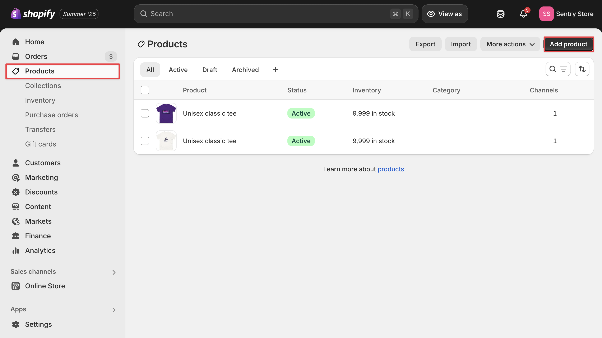
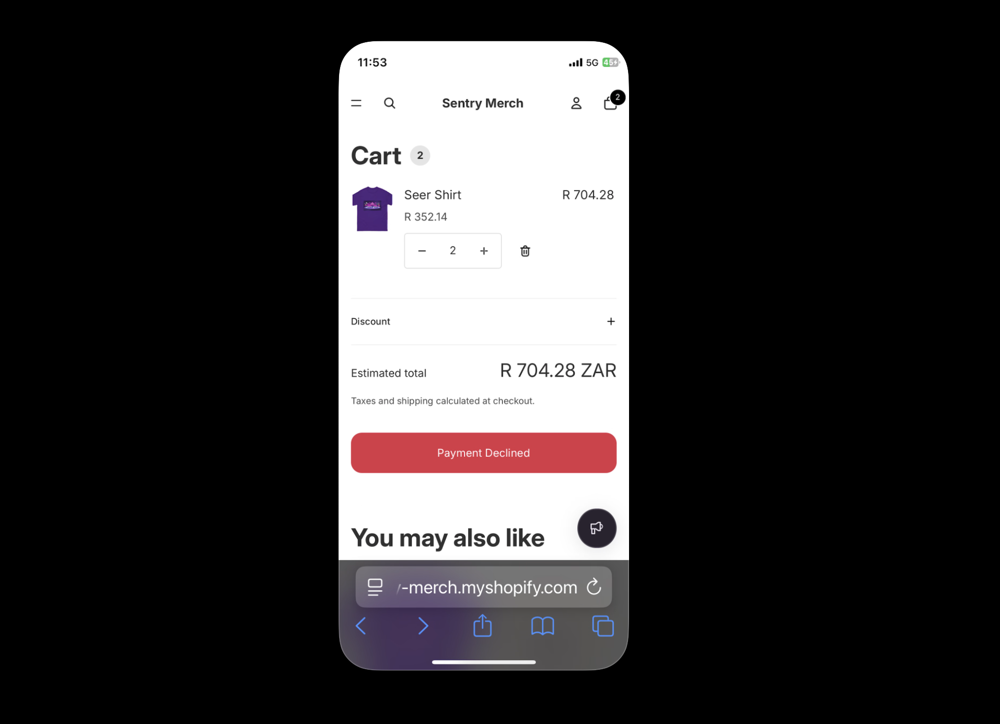
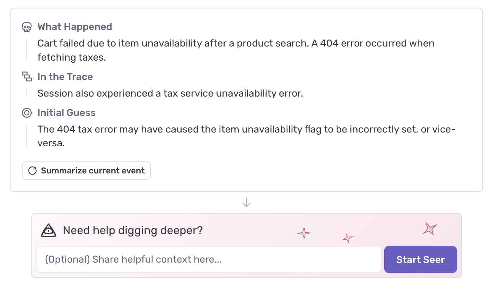

# Using Sentry Session Replay to Debug Ecommerce Performance Issues

When customers abandon their shopping carts or complain about checkout problems, traditional error logs leave us guessing about what actually happened. We might see a "payment timeout" error in our logs, but did the user wait patiently for 30 seconds, or did they rage-click the checkout button dozens of times before giving up? Understanding this difference is essential for fixing the right problem.

Session replay technology transforms ecommerce debugging by showing exactly what users experienced during errors and performance issues. Unlike traditional analytics that show aggregate data, session replay captures and recreates individual user interactions, creating a video-like recording of what users see and do during critical moments like product searches, cart additions, and checkout processes.

This guide demonstrates how to implement complete monitoring in a Shopify environment using Sentry's unified platform, where session replay, performance data, and error information are automatically linked. We'll create realistic ecommerce failure scenarios and show how to connect user frustration with technical root causes, eliminating the traditional gap between customer reports and technical debugging.

## Setting Up Complete Monitoring in Our Shopify Environment

We'll demonstrate Sentry's unified monitoring capabilities using a Shopify store with realistic ecommerce functionality. This setup process shows how to integrate [session replay](https://sentry.io/product/session-replay/) with performance monitoring and error tracking while capturing the context needed for effective debugging.

### Setting Up Sentry

To add Sentry monitoring to our Shopify store, follow these steps:

1. Sign up for a [Sentry account](https://sentry.io).

2. Create a new project by clicking **Create Project**.

3. Choose **Browser JavaScript** as the platform, and give the project a name like **Shopify Store Monitoring**. Click **Create Project** and then **Configure SDK** when prompted.


4. After creating the project, Sentry will provide a data source name (DSN), a unique identifier that tells the Sentry SDK where to send events from our Shopify store.


5. **Enable monitoring features** in the Sentry project settings. Navigate to **Settings** → **SDK Setup** → **Loader Script** and toggle on **Enable Performance Monitoring** and **Enable Session Replay**.


We will use this DSN in the next section when integrating the Sentry SDK into the Shopify theme to enable session replay, performance monitoring, and error tracking for our ecommerce application.

### Setting Up Shopify

To demonstrate Sentry's session replay capabilities in a realistic ecommerce environment, we will set up a Shopify development store.

1. **Create a Shopify Partner account** at [partners.shopify.com](https://partners.shopify.com) if we don't already have one. Partner accounts let us create unlimited development stores for testing without monthly fees.

2. **Create a new development store** by clicking **Stores** in the Partner dashboard, then **Add store**. Choose **Development store** and select **Create a store to test and build** as the purpose.

3. **Create the store** after giving it a name, click **Create Development Store**.


3. **Install the store theme.** Navigate to **Online Store** then **Themes** in the Shopify admin panel. Install the Horizon theme to follow along with this guide. Once we have added this theme, click **Publish**.


4. **Get the store password** by clicking **See store password**. The store requires a password while in development mode.

5. **Add sample products** with different price points to create realistic shopping scenarios. Navigate to **Products** then **Add product** and create a demo product, and click **Save**.



### Integrate Sentry Into Our Shopify Theme

In the Shopify admin, navigate to **Online Store** then **Themes**. Click the three dots on the active theme, then **Edit code**. 

Open the `layout/theme.liquid` file and add the Sentry SDK to the `<head>` section, above `{{ content_for_header }}`.

```html
<script
  src="https://browser.sentry-cdn.com/9.40.0/bundle.tracing.replay.feedback.min.js"
  integrity="sha384-Pe41llaXfNg82Pkv5LMIFFis6s9XOSxijOH52r55t4AU9mzbm6ZzQ/I0Syp8hkk9"
  crossorigin="anonymous"
></script>

<script>
  Sentry.onLoad(function() {
    Sentry.init({
    dsn: "YOUR_DSN_HERE",
      initialScope: {
        tags: {
          store: "{{ shop.name }}",
          page_type: "{{ template.name }}"
        },
        user: {
          
            id: "{{ customer.id }}",
            email: "{{ customer.email }}",
          
        },
        contexts: {
          page: {
            template: "{{ template.name }}",
            url: "{{ canonical_url }}"
          }
        }
      },
      
      tracesSampleRate: 1.0,
      replaysSessionSampleRate: 1.0,
      replaysOnErrorSampleRate: 1.0,

      tracePropagationTargets: ["localhost", /^https?:\/\//],
      
      integrations: [
        Sentry.feedbackIntegration({
          colorScheme: "system",
          enableScreenshot: true,
          showBranding: false,
          showName: true,
          showEmail: true,
          isRequiredEmail: true,
        }),
        Sentry.replayIntegration(),
        Sentry.browserTracingIntegration()
      ],
      
      beforeSend(event) {
        if (typeof window !== 'undefined' && window.cart) {
          event.contexts = event.contexts || {};
          event.contexts.cart = {
            item_count: window.cart.item_count || 0,
            total_price: window.cart.total_price || 0,
            currency: "{{ cart.currency.iso_code }}"
          };
        }
        return event;
      }
    });
    
    document.addEventListener('DOMContentLoaded', function() {
      Sentry.setTag('cart_items', {{ cart.item_count }});
      Sentry.setContext('store_info', {
        currency: "{{ cart.currency.iso_code }}",
        locale: "{{ request.locale.iso_code }}"
      });
    });
  });
</script>
```

Replace `YOUR_DSN_HERE` with the actual Sentry project DSN. This configuration sets up three essential monitoring capabilities for our ecommerce store:

**Session Replay**: The `replaysSessionSampleRate: 1.0` and `replaysOnErrorSampleRate: 1.0` settings capture 100% of user sessions so every error is accompanied by session replay data.

**Performance Monitoring**: The `tracesSampleRate: 1.0` setting turns on performance monitoring for all transactions.

**Ecommerce Context**: The `beforeSend` function automatically adds cart information, customer details, and page-specific data to every event.

**User Feedback Widget**: The `feedbackIntegration` configuration creates a persistent feedback widget that appears as a floating button in our store. When users encounter problems during their shopping experience, they can click this widget to submit feedback, which automatically captures their current session replay along with screenshots of the exact moment they experienced the issue.


## Testing Everything With the Feedback Widget

Before implementing error scenarios, let's verify that our monitoring setup works correctly. Navigate to the Shopify store and interact with different pages. Add products to the cart, browse around, and notice the purple feedback widget in the bottom-right corner. 


Click the feedback widget to test the feedback submission process, then check the Sentry dashboard to confirm that session replays are being captured and user feedback is being recorded.


The feedback widget serves as our direct connection to customer experience issues. When users encounter problems during their shopping journey, they can immediately report issues while the context is fresh, and Sentry automatically associates their feedback with the technical data needed for debugging.

## Setting Up the Complex Checkout Flow Scenario

Now we'll create a detailed checkout flow that demonstrates how session replay connects complex performance issues with user experience problems. This scenario simulates a realistic multi-step checkout process with multiple potential failure points, performance bottlenecks, and proper instrumentation to show how technical issues cascade into user frustration.

Modern ecommerce checkout flows involve multiple services working together: inventory validation, tax calculation, shipping rates, discount application, payment processing, and order creation. When any of these steps fails or performs slowly, users experience checkout abandonment without understanding why. Our implementation creates a realistic scenario where multiple services can fail independently, helping demonstrate how Sentry's unified monitoring reveals the complete picture.

### Step 1: Modify the Existing Button Structure

In the Shopify admin, navigate to **Online Store** then **Themes**, click the three dots on the active theme, then **Edit code**. Open `snippets/cart-summary.liquid` and find this existing button in the `div` with the class `cart__ctas`:

```html
<button
  type="submit"
  id="checkout"
  class="cart__checkout-button button"
  name="checkout"
  
    disabled
  
  form="cart-form"
>
  {{ 'content.checkout' | t }}
</button>
```

Replace it with:

```html
<button
  type="submit"
  id="checkout"
  class="cart__checkout-button button"
  name="checkout"
  
    disabled
  
  form="cart-form"
>
  <span id="checkout-button-text">{{ 'content.checkout' | t }}</span>
  <span id="checkout-spinner" style="display: none;">⏳</span>
</button>
```

### Step 2: Add Detailed Checkout Flow After the Existing Stylesheet

The file has a `` section at the bottom. Add this JavaScript section right **after** the closing `` tag:

```html
<script>
document.addEventListener('DOMContentLoaded', function() {
  const checkoutBtn = document.getElementById('checkout');
  if (checkoutBtn && checkoutBtn.form && checkoutBtn.form.id === 'cart-form') {
    checkoutBtn.addEventListener('click', function(e) {
      if ({{ cart.item_count }} === 0) return;
      
      e.preventDefault();
      
      const buttonText = document.getElementById('checkout-button-text');
      const spinner = document.getElementById('checkout-spinner');
      
      if (!buttonText || !spinner) return;
      
      // Show loading state
      checkoutBtn.disabled = true;
      buttonText.style.display = 'none';
      spinner.style.display = 'inline-block';
      
      // Start the instrumented checkout flow
      processComplexCheckout()
        .then(() => {
          window.location.href = '{{ routes.cart_url }}/checkout';
        })
        .catch(error => {
          handleCheckoutError(error, checkoutBtn, buttonText, spinner);
        });
    });
  }
});

async function processComplexCheckout() {
  // Check if Sentry is available
  if (typeof Sentry === 'undefined') {
    console.warn('Sentry not available, falling back to basic flow');
    return basicCheckoutFlow();
  }

  return await Sentry.startSpan(
    { 
      name: "Complete Checkout Flow", 
      op: "checkout.process",
      attributes: {
        "checkout.cart_total": {{ cart.total_price | divided_by: 100.0 }},
        "checkout.item_count": {{ cart.item_count }}
      }
    },
    async (checkoutSpan) => {
      const checkoutData = {
        cartTotal: {{ cart.total_price | divided_by: 100.0 }},
        itemCount: {{ cart.item_count }},
        startTime: Date.now()
      };

      try {
        // Step 1: Validate cart items
        await Sentry.startSpan(
          { name: "Validate Cart Items", op: "checkout.validate" },
          () => validateCartItems(checkoutData)
        );
        
        // Step 2: Calculate shipping rates (the main bottleneck)
        await Sentry.startSpan(
          { name: "Calculate Shipping Rates", op: "checkout.shipping" },
          () => calculateShippingRates(checkoutData)
        );
        
        // Step 3: Process payment
        await Sentry.startSpan(
          { name: "Process Payment", op: "checkout.payment" },
          () => processPayment(checkoutData)
        );
        
        checkoutSpan.setAttributes({
          "checkout.success": true,
          "checkout.total_time_ms": Date.now() - checkoutData.startTime
        });
        
        return { success: true };
        
      } catch (error) {
        checkoutSpan.setStatus({ code: 2, message: error.message });
        checkoutSpan.setAttributes({
          "checkout.success": false,
          "checkout.error_step": error.step || "unknown"
        });
        
        Sentry.captureException(error, {
          tags: {
            operation: 'checkout_flow',
            checkout_step: error.step || 'unknown'
          },
          extra: {
            checkout_data: checkoutData,
            total_value: checkoutData.cartTotal
          }
        });
        
        throw error;
      }
    }
  );
}

async function basicCheckoutFlow() {
  await new Promise(resolve => setTimeout(resolve, 1500));
  if (Math.random() < 0.1) {
    throw new Error('Basic checkout failed');
  }
  return { success: true };
}

async function validateCartItems(checkoutData) {
  return new Promise((resolve, reject) => {
    setTimeout(() => {
      // 10% chance of validation failure
      if (Math.random() < 0.1) {
        const error = new Error('Item no longer available');
        error.step = 'validation';
        reject(error);
        return;
      }
      resolve({ validated: true });
    }, 300);
  });
}

async function calculateShippingRates(checkoutData) {
  return new Promise((resolve, reject) => {
    setTimeout(() => {
      // 15% chance of shipping failure - this is our main bottleneck
      if (Math.random() < 0.15) {
        const error = new Error('Shipping service unavailable');
        error.step = 'shipping';
        reject(error);
        return;
      }
      resolve({ rates: [{ cost: 5.99, provider: 'Standard' }] });
    }, 2000); // 2 second delay to simulate slow shipping API
  });
}

async function processPayment(checkoutData) {
  return new Promise((resolve, reject) => {
    setTimeout(() => {
      // 5% chance of payment failure
      if (Math.random() < 0.05) {
        const error = new Error('Payment declined');
        error.step = 'payment';
        reject(error);
        return;
      }
      resolve({ authorized: true });
    }, 500);
  });
}

function handleCheckoutError(error, button, buttonText, spinner) {
  button.disabled = false;
  spinner.style.display = 'none';
  buttonText.style.display = 'inline-block';
  
  const errorMessages = {
    'validation': 'Item Unavailable',
    'shipping': 'Shipping Error',
    'payment': 'Payment Declined'
  };
  
  buttonText.textContent = errorMessages[error.step] || 'Checkout Error';
  button.style.backgroundColor = '#dc3545';
  button.style.color = 'white';
  
  // Reset after 4 seconds
  setTimeout(() => {
    buttonText.textContent = '{{ 'content.checkout' | t }}';
    button.style.backgroundColor = '';
    button.style.color = '';
  }, 4000);
}
</script>
```

This code sets up realistic ecommerce issues, creating a multi-step checkout process where each stage can fail independently. The code uses Sentry's performance monitoring to track each operation's timing and success rate.

## Testing the Checkout Flow With Mobile Device Feedback

Add several products to the cart to create a realistic checkout scenario, then navigate to the `/cart` page on both desktop and mobile devices. Click the **Checkout** button to trigger the complex checkout process. The loading state persists longer than typical ecommerce flows, especially during the shipping calculation phase which acts as the primary bottleneck.

The checkout process may succeed after several seconds, or it may fail at any step with specific error messages like **Shipping Error** or **Payment Declined**. Each failure represents a different technical issue that would require different debugging approaches in production.



Test the checkout flow multiple times to trigger different failure scenarios. This triggers various error conditions, each providing different performance traces and error context in Sentry. 

While experiencing checkout failures on mobile devices, click the purple feedback widget to submit reports about the specific issues encountered.


## Viewing User Feedback in Sentry

Navigate to the Sentry project dashboard and click **Issues** then **User Feedback** in the sidebar. The feedback submissions created connect to much more detailed technical data than simple API timeouts.


Each feedback entry links to detailed performance traces showing exactly which step in the checkout process failed, how long each operation took, and what the user experienced during the entire flow. This connection eliminates guesswork about which technical issues correlate with user frustration and checkout abandonment.

## Connecting Feedback to Session Replay and Detailed Performance Data

Click on any feedback entry to see the complete context that Sentry automatically captured for the complex checkout flow. The feedback detail view now connects multiple layers of technical information that would traditionally require separate tools and manual correlation.

### Session Replay

The session replay shows the complete user journey through the extended checkout process. We can watch users interact with the cart, click checkout multiple times, and encounter various error scenarios. Session replay captures the sequence of user actions and system failures that occur during complex checkout flows.


The replay reveals user behavior patterns during checkout failures. Users often retry checkout actions multiple times when errors occur, and session replay captures these repeated interactions along with the specific error conditions that caused each failure, providing clear insight into where the checkout process breaks down.

### Performance Traces

The performance trace now shows a waterfall of all checkout operations with nested span relationships. We can see how cart validation leads to tax calculation, how shipping and discount operations run in parallel, and where the process bottlenecks or fails completely.


Performance traces reveal the cascade effect of slow operations. When shipping calculation takes 2+ seconds, the entire checkout experience feels sluggish even if other operations complete quickly. The trace shows exactly which operations consume the most time and how parallel processing helps mitigate some delays.

### Detailed Error Context With Business Impact

Error details now include rich context about which step failed, what the cart contents were, how long the process had been running, and what the business impact represents. Each error includes the complete checkout state, making it possible to reproduce issues or understand why specific combinations of cart contents trigger failures.


Error context transforms generic failure messages into actionable debugging information. Instead of knowing that **checkout failed,** we have specific details about cart value, processing time, which integration failed, and how many customers might be affected by similar issues.

### Network Requests and Third-Party Integration Monitoring

The network tab shows all API calls made during the checkout process, including the intentional tax service call that demonstrates how to monitor third-party integrations. We can see request timing, headers, payloads, and responses for each step in the checkout flow.


Network monitoring reveals how third-party service performance affects user experience. Slow shipping provider APIs or unreliable tax calculation services directly impact checkout completion rates, and Sentry's integration shows exactly where these dependencies create user experience problems.

### AI-Powered Root Cause Analysis With Sentry Seer

When debugging complex ecommerce flows with multiple integration points, understanding how seemingly unrelated errors connect can be challenging. Sentry's AI assistant, [Seer](https://sentry.io/product/seer/), automatically analyzes error patterns and suggests potential relationships between failures across our checkout process.


In this example, Seer identifies that the 404 tax service error may have cascaded to cause the inventory availability flag to be incorrectly set. Rather than treating these as separate issues, Seer recognizes the potential connection and provides an initial hypothesis for investigation.



Seer's analysis transforms complex multi-step failures into actionable debugging paths. Instead of manually correlating the tax service timeout with the subsequent inventory error, the AI immediately suggests that the failed tax calculation may have disrupted the checkout state management, leading to incorrect inventory flags. This accelerates debugging by pointing developers toward the actual root cause rather than just the most visible symptom.

## The Complete Debugging Picture

When a customer reports that **checkout doesn't work,** separate monitoring tools force us to check user session replay software in one system, look up performance data in another platform, search for related errors in a third tool, and manually piece together the complete story. Sentry's integrated approach automatically links session replays with performance traces and error information, ensuring we see the complete technical and user experience context.

Sentry's unified platform allows for advanced analysis that separate tools cannot provide. We can identify patterns where specific performance bottlenecks consistently lead to user abandonment, correlate error conditions with support ticket volume, and prioritize fixes based on actual business impact rather than just technical severity. This holistic view helps us understand not just what broke, but how technical issues affect revenue and customer satisfaction.

Performance optimization becomes data-driven when we can see exactly how checkout delays correlate with abandonment rates. The sample rate for Sentry session replay can be optimized based on traffic volume and debugging needs, balancing thorough monitoring with data storage costs while ensuring critical business flows are always monitored.

## Further Reading

To learn more about implementing session replay tools in ecommerce environments, explore these resources:

- [Session Replay Product Overview](https://sentry.io/product/session-replay/) – Complete guide to Sentry's session replay capabilities
- [Session Replay Documentation](https://docs.sentry.io/product/explore/session-replay/) – Technical documentation and configuration options
- [Getting Started with Session Replay](https://blog.sentry.io/getting-started-with-session-replay/) – Step-by-step implementation guide
- [Session Replay for Mobile Apps](https://blog.sentry.io/session-replay-for-mobile-is-now-generally-available-see-what-your-users-see/) – Mobile session replay features and React Native integration
- [User Feedback Widget for Mobile Apps](https://blog.sentry.io/user-feedback-widget-for-mobile-apps/) – Connecting user feedback with session replay data
- [Flutter SDK Integration](https://blog.sentry.io/introducing-sentrys-flutter-sdk-9-0/) – Session replay for Flutter applications