# Using Sentry session replay to debug ecommerce performance issues

When customers abandon their shopping carts or complain about checkout problems, traditional error logs leave you guessing about what actually happened. You might see a "payment timeout" error in your logs, but did the user wait patiently for 30 seconds, or did they rage-click the checkout button dozens of times before giving up? Understanding this difference is crucial for fixing the right problem.

This is where session replay technology transforms ecommerce debugging. Session replay gives you the "what" and "when" by showing exactly what users experienced during errors and performance issues. Performance monitoring provides the "how slow" and "where in the code" with precise timing data and traces. Error tracking delivers the "why it broke" with complete stack traces and breadcrumbs. When these capabilities work together in a unified platform like Sentry, you get complete context about ecommerce issues without jumping between different replay and monitoring solutions to piece everything together.

Traditional debugging approaches force you to correlate data across multiple tools. You might use one tool for website session recording, another for performance monitoring, and a third for error tracking. Sentry's integrated approach means user session replay, performance data, and error information are automatically linked, giving you the full story when users encounter problems during their shopping experience.

Session replay captures and recreates user interactions on your website, creating a video-like recording of exactly what users see and do. In ecommerce applications, this technology helps you understand user behavior during critical moments like product searches, cart additions, and checkout processes. Unlike traditional analytics that show aggregate data about user actions, browser session replay software lets you watch individual user journeys that led to specific problems.

The advantages of replay become clear when combined with performance monitoring and error tracking. A slow API call might show up in your performance metrics, but session replay shows you how users react to that slowness. Modern rum session replay tools also respect user privacy by automatically masking sensitive information like payment details and personal data.

## Setting up comprehensive monitoring in your Shopify environment

We'll demonstrate Sentry's unified monitoring capabilities using a Shopify store with realistic ecommerce functionality. This setup process shows you how to integrate [session replay](https://sentry.io/product/session-replay/) with performance monitoring and error tracking while capturing the context needed for effective debugging.

### Setting Up Sentry

To add Sentry monitoring to your Shopify store, follow these steps:

1. Sign up for a [Sentry account](https://sentry.io).

2. Create a new project by clicking **Create Project**.

3. Choose **Browser JavaScript** as your platform, and give your project a name like "Shopify Store Monitoring". Click **Create Project** and then **Configure SDK** when prompted.

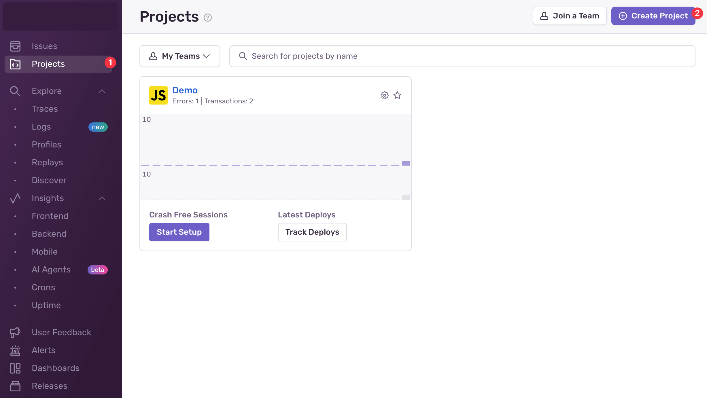

4. After creating the project, Sentry will provide you with a data source name (DSN), a unique identifier that tells the Sentry SDK where to send events from your Shopify store.

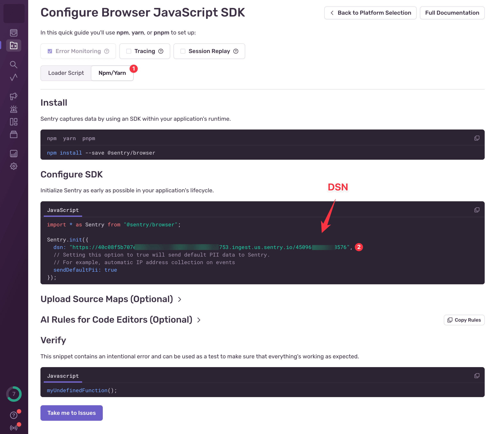

We will use this DSN in the next section when integrating the Sentry SDK into the Shopify theme to enable session replay, performance monitoring, and error tracking for your ecommerce application.

### Setting Up Shopify

To demonstrate Sentry's session replay capabilities in a realistic ecommerce environment, we will set up a Shopify development store.

1. **Create a Shopify Partner account** at [partners.shopify.com](https://partners.shopify.com) if you don't already have one. Partner accounts let you create unlimited development stores for testing without monthly fees.

2. **Create a new development store** by clicking "Stores" in your Partner dashboard, then "Add store". Choose "Development store" and select "Create a store to test and build" as your purpose.

3. **Create your store** after giving it a name, click **Create Development Store**.

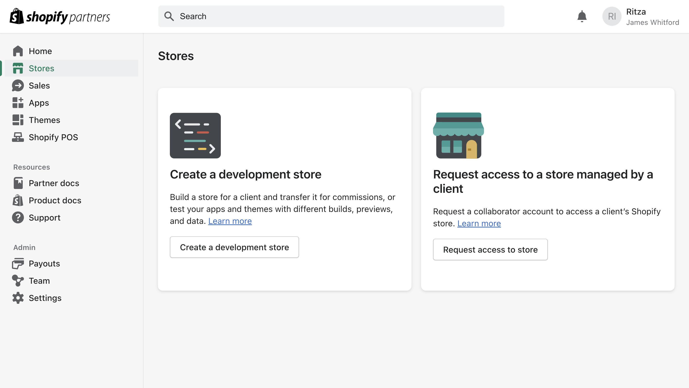

3. **Install your store theme.** Navigate to "Online Store" then "Themes" in your Shopify admin panel. Install the Horizon theme to follow along with this guide. Once you have added this theme, click **Publish**.

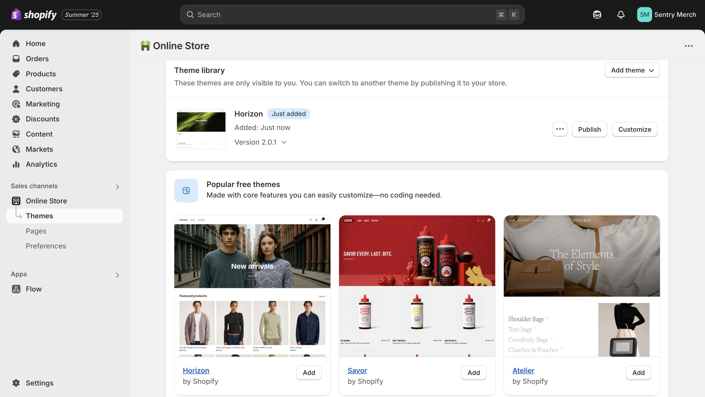

4. **Get the store password** by clicking **See store password**. The store requires a password while in development mode.

5. **Add sample products** with different price points to create realistic shopping scenarios. Navigate to "Products" then "Add product" and create a demo product, and click **Save**.

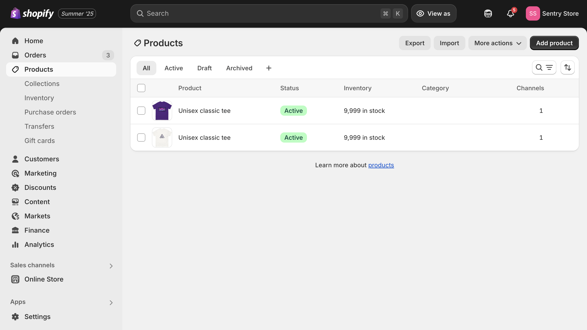

### Integrate Sentry into your Shopify Theme

In your Shopify admin, navigate to "Online Store" then "Themes". Click the three dots on your active theme, then "Edit code". 

Open the `layout/theme.liquid` file and add the Sentry SDK to the `<head>` section, before `{{ content_for_header }}`.

```html
<script
  src="https://browser.sentry-cdn.com/9.40.0/bundle.tracing.replay.feedback.min.js"
  integrity="sha384-Pe41llaXfNg82Pkv5LMIFFis6s9XOSxijOH52r55t4AU9mzbm6ZzQ/I0Syp8hkk9"
  crossorigin="anonymous"
></script>

<script>
  Sentry.onLoad(function() {
    Sentry.init({
    dsn: "YOUR_DSN_HERE",
      initialScope: {
        tags: {
          store: "{{ shop.name }}",
          page_type: "{{ template.name }}"
        },
        user: {
          
            id: "{{ customer.id }}",
            email: "{{ customer.email }}",
          
        },
        contexts: {
          page: {
            template: "{{ template.name }}",
            url: "{{ canonical_url }}"
          }
        }
      },
      
      tracesSampleRate: 1.0,
      replaysSessionSampleRate: 1.0,
      replaysOnErrorSampleRate: 1.0,
      
      integrations: [
        Sentry.feedbackIntegration({
          colorScheme: "system",
          enableScreenshot: true,
          showBranding: false,
          showName: true,
          showEmail: true,
          isRequiredEmail: true,
        }),
      ],
      
      beforeSend(event) {
        if (typeof window !== 'undefined' && window.cart) {
          event.contexts = event.contexts || {};
          event.contexts.cart = {
            item_count: window.cart.item_count || 0,
            total_price: window.cart.total_price || 0,
            currency: "{{ cart.currency.iso_code }}"
          };
        }
        return event;
      }
    });
    
    document.addEventListener('DOMContentLoaded', function() {
      Sentry.setTag('cart_items', {{ cart.item_count }});
      Sentry.setContext('store_info', {
        currency: "{{ cart.currency.iso_code }}",
        locale: "{{ request.locale.iso_code }}"
      });
    });
  });
</script>
```

Replace `YOUR_DSN_HERE` with your actual Sentry project DSN. This configuration sets up three essential monitoring capabilities for your ecommerce store:

**Session Replay Configuration**: The `replaysSessionSampleRate: 1.0` and `replaysOnErrorSampleRate: 1.0` settings capture 100% of user sessions and ensure every error is accompanied by session replay data. This comprehensive capture rate is ideal for development and testing environments where you want complete visibility into user behavior.

**Performance Monitoring**: The `tracesSampleRate: 1.0` setting enables performance monitoring for all transactions, allowing you to identify slow API calls, database queries, and frontend operations that impact user experience.

**User Feedback Widget**: The `feedbackIntegration` configuration creates a persistent feedback widget that appears as a floating button in your store. When users encounter problems during their shopping experience, they can click this widget to submit feedback, which automatically captures their current session replay along with screenshots of the exact moment they experienced the issue.

**Ecommerce Context**: The `beforeSend` function automatically adds cart information, customer details, and page-specific data to every event. This context becomes crucial when debugging issues because you can immediately see which products were in the user's cart, their customer status, and what page template they were viewing when problems occurred.

Once implemented, the feedback widget appears as a floating button in the bottom-right corner of your store, ready to collect user reports when they encounter issues during checkout, search, or cart operations.

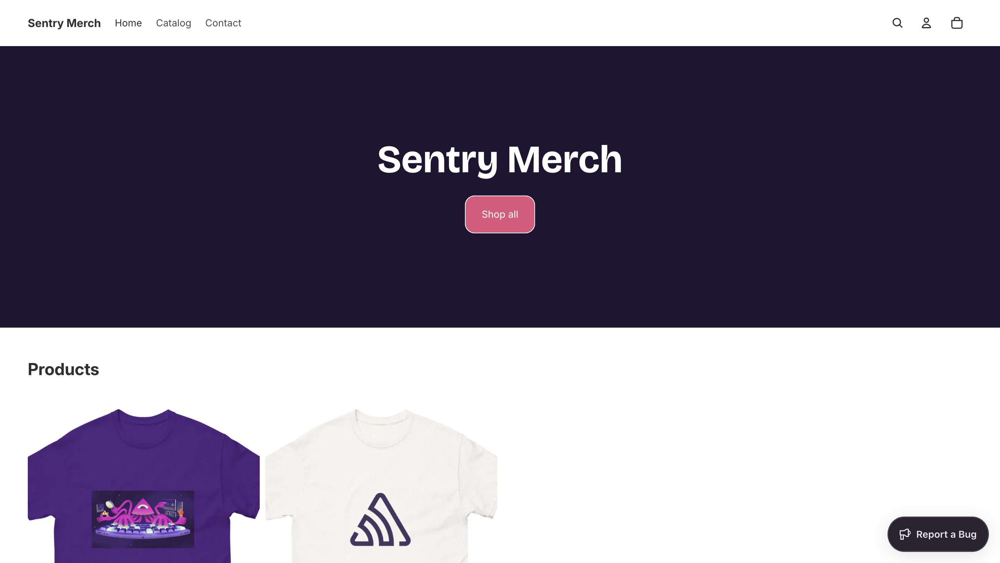

The feedback widget integrates seamlessly with session replay and performance monitoring. When users submit feedback about slow checkout processes or confusing error messages, their reports automatically include up to 30 seconds of session replay data leading up to the feedback submission, plus any performance data and errors that occurred during their session. This integration eliminates the typical disconnect between user complaints and technical debugging information.

For comprehensive setup guidance, check out the [getting started with session replay](https://blog.sentry.io/getting-started-with-session-replay/) guide.

## Identifying user frustration during checkout failures

Our first scenario demonstrates how session replay technology reveals user behavior patterns that traditional monitoring completely misses. When checkout processes hang due to slow external APIs, users exhibit specific frustration behaviors that session replay captures in detail, giving you insights that error logs alone never provide.

Open the `snippets/cart-summary.liquid` file and find the existing checkout button. Replace it with this enhanced version that demonstrates shipping API timeout handling:

```html
<div class="cart__ctas">
  <button
    type="submit"
    id="checkout"
    class="cart__checkout-button button"
    name="checkout"
    
      disabled
    
    form="cart-form"
  >
    <span id="checkout-button-text">{{ 'content.checkout' | t }}</span>
    <span id="checkout-spinner" class="loading__spinner" style="display: none;"></span>
  </button>

  
    <div class="additional-checkout-buttons additional-checkout-buttons--vertical">
      {{ content_for_additional_checkout_buttons }}
    </div>
  
</div>

<script>
document.addEventListener('DOMContentLoaded', function() {
  const checkoutBtn = document.getElementById('checkout');
  if (checkoutBtn) {
    checkoutBtn.addEventListener('click', function(e) {
      e.preventDefault();
      
      const buttonText = document.getElementById('checkout-button-text');
      const spinner = document.getElementById('checkout-spinner');
      
      checkoutBtn.disabled = true;
      buttonText.style.display = 'none';
      spinner.style.display = 'inline-block';
      buttonText.textContent = 'Calculating shipping...';
      
      const controller = new AbortController();
      const timeoutId = setTimeout(() => controller.abort(), 12000);

      fetch('/cart/shipping_rates.json', {
        method: 'POST',
        headers: {
          'Content-Type': 'application/json',
          'X-Requested-With': 'XMLHttpRequest'
        },
        signal: controller.signal,
        body: JSON.stringify({
          shipping_address: {
            zip: '12345',
            country: 'US',
            province: 'CA'
          }
        })
      })
      .then(response => {
        clearTimeout(timeoutId);
        if (!response.ok) throw new Error(`HTTP ${response.status}`);
        return response.json();
      })
      .catch(error => {
        clearTimeout(timeoutId);
        console.error('Shipping calculation failed:', error);
        
        checkoutBtn.disabled = false;
        spinner.style.display = 'none';
        buttonText.style.display = 'inline-block';
        buttonText.textContent = 'Try Again - Shipping Error';
        checkoutBtn.style.backgroundColor = '#dc3545';
        
        throw error;
      });
    });
  }
});
</script>
```

This implementation makes a real HTTP request to Shopify's shipping rates endpoint and uses AbortController to handle genuine timeout scenarios. Add some products to your cart and navigate to the cart page. Click the checkout button and observe the 12-second timeout behavior.


The screenshot above shows the checkout button in its loading state with the spinner visible. Users typically won't wait this long without taking action, creating the exact frustration patterns that session replay helps you identify and understand.

Now navigate to your Sentry project dashboard and click "Replays" in the sidebar. You'll see your recorded session listed with key metrics like duration and error count. Click on the replay entry to open the session replay player.

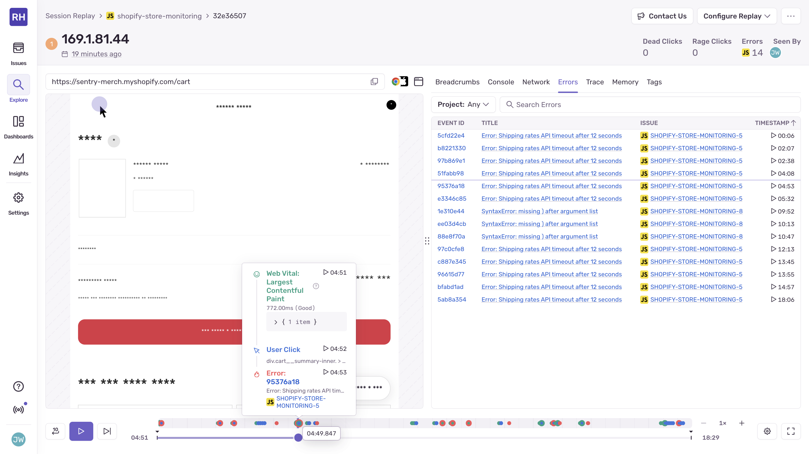

The replays dashboard shows your checkout session prominently, with indicators showing it contained errors and significant user activity. The replay duration will be around 15-20 seconds, capturing the entire user interaction from cart viewing through the failed checkout attempt.

When you open the specific replay, Sentry's session replay player shows the complete user journey. The main panel displays the visual reproduction of what the user saw, while the timeline below shows user interactions, network requests, and performance events synchronized together.


This screenshot demonstrates how session replay captures user behavior during the checkout delay. You can see multiple click events clustered together on the timeline, indicating the user repeatedly clicked the unresponsive checkout button. The replay shows the exact moment frustration sets in, typically around 3-4 seconds into the delay when users realize the interface isn't responding normally.

Click "Performance" in the Sentry sidebar to view the transaction data for this scenario. The performance dashboard immediately flags the checkout operation as abnormally slow, with the 12-second duration standing out clearly against normal transaction patterns.


The performance trace reveals exactly where time was spent during the checkout attempt. The shipping API call appears as a long span consuming nearly the entire transaction duration. This view connects the technical performance problem with the user experience captured in session replay.

Navigate to "Issues" in Sentry to see the captured error information. The shipping timeout error appears with complete context including user information, cart contents, and a direct link to the associated session replay.

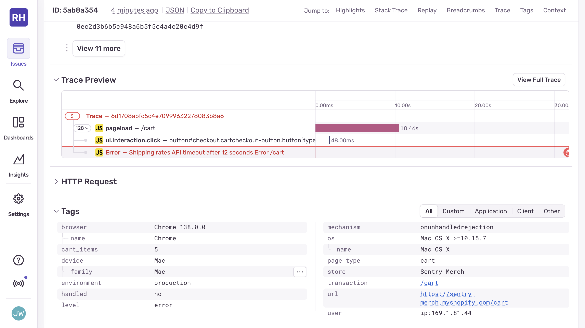

This error view demonstrates Sentry's unified approach. Instead of manually correlating an error log entry with user behavior data from a separate tool, you can immediately jump from the error details to watching exactly how the user experienced the problem. The error includes ecommerce-specific context like cart value and items, helping you understand the business impact.

Sentry's AI-powered assistant, Seer, analyzes this pattern across multiple sessions and suggests implementing proper timeout handling for shipping API calls. The AI recognizes that users consistently abandon checkout when shipping calculations exceed 5-6 seconds and recommends either optimizing the API calls or providing better user feedback during delays.


Seer's recommendations combine technical solutions with user experience improvements. The AI suggests implementing client-side timeout handling, adding progress indicators with estimated completion times, and providing alternative shipping options when the primary API is slow. These suggestions come from analyzing user behavior patterns across multiple session replays.

When users encounter this checkout problem, the feedback widget provides an easy way for them to report the issue directly. Since the widget automatically includes session replay data and performance context, user reports come with the complete technical information needed for debugging, eliminating the typical disconnect between user complaints and technical investigation.

## Debugging search performance across web and mobile platforms

Search functionality represents one of the most critical ecommerce user flows, and performance problems here can immediately impact sales conversion. This scenario demonstrates how Sentry session replay works across different platforms, showing you the complete picture of search performance issues whether users encounter them on web browsers or mobile applications.

Open the `assets/predictive-search.js` file and find the `#getSearchResults` method. Modify it to include proper timeout handling that demonstrates search API performance problems:

```javascript
/**
 * Fetch search results using the section renderer and update the results container.
 * @param {string} searchTerm - The term to search for
 */
async #getSearchResults(searchTerm) {
  if (!this.dataset.sectionId) return;

  const url = new URL(Theme.routes.predictive_search_url, location.origin);
  url.searchParams.set('q', searchTerm);
  url.searchParams.set('resources[limit_scope]', 'each');

  const { predictiveSearchResults } = this.refs;

  const abortController = this.#createAbortController();

  const timeoutId = setTimeout(() => {
    abortController.abort();
  }, 8000);

  sectionRenderer
    .getSectionHTML(this.dataset.sectionId, false, url)
    .then((resultsMarkup) => {
      clearTimeout(timeoutId);
      
      if (!resultsMarkup) return;
      if (abortController.signal.aborted) return;

      morph(predictiveSearchResults, resultsMarkup);
      this.#resetScrollPositions();
    })
    .catch((error) => {
      clearTimeout(timeoutId);
      
      if (abortController.signal.aborted) return;
      if (error.name === 'AbortError') {
        throw new Error('Search request aborted after 8 second timeout');
      }
      throw error;
    });
}
```

This modification implements proper timeout handling using AbortController, which creates genuine timeout errors when search operations exceed 8 seconds. Test your store's search functionality by typing in the search box. After entering three or more characters, you'll experience the timeout behavior when the search API doesn't respond within the expected timeframe.


The search interface shows the loading state during the timeout period. Users experiencing this delay often try multiple search terms, clear and retype their queries, or click elsewhere on the page thinking the search function is broken.

When you view this scenario in Sentry's session replay player, the user behavior patterns become immediately clear. The replay captures users typing, waiting, then trying alternative approaches when results don't appear quickly.


This replay timeline reveals typical user reactions to slow search performance. The user types "summer dress" but when no results appear after 2-3 seconds, they clear the search and try "dress" instead. The second search also experiences the same delay, leading to visible user frustration captured in the replay.

For mobile session replay, Sentry provides the same comprehensive monitoring capabilities through React Native integration. If your ecommerce application includes a mobile app, the session replay data shows how search performance problems affect mobile users differently than web users. [Mobile session replay](https://blog.sentry.io/session-replay-for-mobile-is-now-generally-available-see-what-your-users-see/) captures the complete mobile user experience with the same level of detail as web session replay.


Mobile session replay captures touch gestures, scrolling behavior, and app state changes that help you understand how users navigate search functionality on mobile devices. Mobile users often exhibit different behavior patterns, such as using voice search when typing becomes frustrating, or switching between apps when search results don't appear quickly.

The performance monitoring data for this scenario shows the search API timeout occurring after 8 seconds, which appears as a clear anomaly in your performance dashboard. The trace waterfall view breaks down the search operation, showing where time is spent during the timeout period.


This performance trace connects the technical problem (aborted search request) with the user experience captured in session replay. You can see that while the search operation was aborted after 8 seconds, the user started exhibiting frustration behaviors after just 2-3 seconds of waiting.

When users encounter slow search performance, the feedback widget allows them to report the issue directly from within their shopping experience. Since the widget automatically includes session replay data and performance context, their reports provide complete technical information about the search delay problem.


The user feedback widget remains accessible in the corner of the screen, allowing users to report search performance issues at their convenience. The feedback is automatically associated with the current session replay and performance data, giving you complete context about the reported problem without requiring additional investigation.

Sentry's unified monitoring approach means you can analyze search performance issues across both web and mobile platforms from a single dashboard. This consolidated view helps you understand whether performance problems affect all users equally or if certain platforms, devices, or geographic regions experience disproportionate issues.

The sample rate for Sentry session replay can be configured based on your specific monitoring needs and data volume requirements. For ecommerce applications, many teams start with 100% session replay capture during development and testing, then adjust to 10-20% for production traffic while maintaining higher capture rates for critical user flows like search and checkout.

## Investigating API errors with complete user context

API integration problems represent some of the most challenging ecommerce debugging scenarios because they often occur after apparently successful user actions, creating confusion about what actually failed. This scenario demonstrates how Sentry's unified monitoring platform connects API errors with the complete user journey, eliminating the guesswork typically involved in debugging integration issues.

Open the `assets/product-form.js` file and find the section that handles adding products to the cart. Add this code after the successful cart addition logic to demonstrate a shipping rates API integration problem:

```javascript
setTimeout(() => {
  const problematicQuery = {
    cart: {
      id: window.cart?.id,
      estimatedShipping: true,
      futureDeliveryOptions: true,
      carbonNeutralOptions: true,
      quantumShipping: true
    }
  };
  
  fetch(`${routes.cart_url}/shipping_rates.json`, {
    method: 'POST',
    headers: {
      'Content-Type': 'application/json',
      'X-Requested-With': 'XMLHttpRequest'
    },
    body: JSON.stringify(problematicQuery)
  })
  .then(response => {
    if (!response.ok) {
      throw new Error(`Shipping API error: ${response.status}`);
    }
    return response.json();
  })
  .catch(error => {
    console.error('Shipping rates API failed:', error);
    
    const errorBanner = document.createElement('div');
    errorBanner.className = 'cart-error-banner';
    errorBanner.style.cssText = `
      background: #dc3545;
      color: white;
      padding: 1rem;
      text-align: center;
      position: fixed;
      top: 0;
      left: 0;
      right: 0;
      z-index: 9999;
    `;
    errorBanner.textContent = 'Unexpected error occurred while calculating shipping rates';
    document.body.appendChild(errorBanner);
    
    setTimeout(() => {
      errorBanner.remove();
    }, 5000);
    
    throw error;
  });
}, 2000);
```

This code demonstrates a realistic API integration problem where the frontend tries to use shipping API fields that don't exist in the current API version. The error appears two seconds after adding items to the cart, creating the type of confusing user experience that traditional monitoring tools struggle to debug effectively.

Add any product to your cart and observe the sequence of events. The product addition appears successful, the cart updates normally, then an unexpected error banner appears after a brief delay.

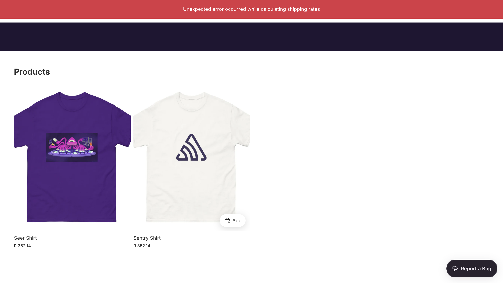

This screenshot captures the moment when the API error manifests as a user-visible problem. The cart appears to have updated successfully, but the error banner creates confusion about whether the operation actually worked correctly.

When you view this scenario in Sentry's session replay player, the complete user journey becomes clear. The replay shows the successful product addition, brief normal browsing, then the sudden appearance of the error banner.

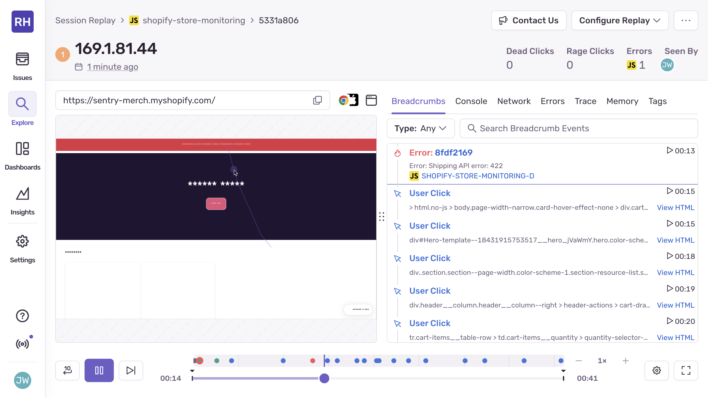

The session replay timeline reveals the critical insight that the error isn't related to the initial product addition but to a subsequent API call that failed. This context helps developers understand the root cause and prevents them from investigating the wrong parts of the application.

The error tracking in Sentry captures the API integration problem with complete technical context, including the specific API fields that caused the failure and the HTTP response codes returned by the server.


This error view demonstrates how Sentry connects technical error information with user experience data. The error details include the specific API fields that don't exist (`carbonNeutralOptions`, `quantumShipping`), helping developers understand exactly what needs to be fixed in the integration.

The unified monitoring approach means you can immediately jump from the error details to watching exactly how users experienced the problem. The session replay shows that users are often confused by this type of delayed error, sometimes attempting to add items to their cart multiple times because they're uncertain whether the first attempt succeeded.

Performance monitoring for this scenario shows the failed API call in the network trace, with timing information and response codes that help developers understand the technical aspects of the integration problem.

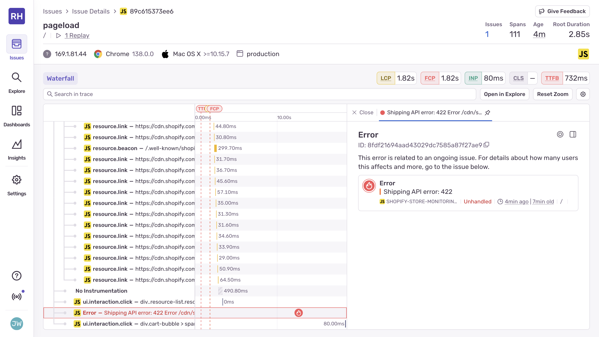

The performance trace reveals that while the API call failed quickly (returning an error within 200ms), the user experience impact extends beyond the technical failure. Users may spend several minutes trying to understand whether their cart addition succeeded, impacting their overall shopping experience.

User session replay software tools that work in isolation would show you the visual user experience but miss the technical context about why the error occurred. Traditional API monitoring might capture the failed request but not show you how users reacted to the error. Sentry's unified platform automatically connects these different data types, giving you the complete picture needed for effective debugging.

This type of integration problem often affects only certain user actions or specific product configurations, making it difficult to reproduce in development environments. Session replay data helps you understand the specific conditions that trigger these API errors, enabling more targeted testing and verification of fixes.

## Analyzing database performance impact on user experience

Database performance issues create some of the most frustrating ecommerce experiences because they make interfaces feel completely broken to users. This scenario demonstrates how Sentry's unified monitoring platform connects slow database operations with their actual impact on user behavior, helping you prioritize performance optimizations based on real user experience data rather than just technical metrics.

Open the `assets/component-cart-items.js` file and find the `updateQuantity` method. Replace it with this enhanced version that demonstrates database performance monitoring:

```javascript
/**
 * Updates the quantity.
 * @param {Object} config - The config.
 * @param {number} config.line - The line.
 * @param {number} config.quantity - The quantity.
 * @param {string} config.action - The action.
 */
updateQuantity(config) {
  const cartPerformaceUpdateMarker = cartPerformance.createStartingMarker(`${config.action}:user-action`);

  this.#disableCartItems();

  const { line, quantity } = config;
  const { cartTotal } = this.refs;

  const cartItemsComponents = document.querySelectorAll('cart-items-component');
  const sectionsToUpdate = new Set([this.sectionId]);
  cartItemsComponents.forEach((item) => {
    if (item instanceof HTMLElement && item.dataset.sectionId) {
      sectionsToUpdate.add(item.dataset.sectionId);
    }
  });

  const body = JSON.stringify({
    line: line,
    quantity: quantity,
    sections: Array.from(sectionsToUpdate).join(','),
    sections_url: window.location.pathname,
  });

  cartTotal?.shimmer();

  // Show progress dialog immediately
  this.showProgressDialog('Updating cart...');

  const startTime = performance.now();

  fetch(`${Theme.routes.cart_change_url}`, fetchConfig('json', { body }))
    .then((response) => {
      const duration = performance.now() - startTime;
      
      if (duration > 3000) {
        Sentry.addBreadcrumb({
          message: 'Cart update slower than expected',
          data: {
            duration: `${Math.round(duration)}ms`,
            line: line,
            quantity: quantity
          }
        });
      }
      
      this.hideProgressDialog();
      
      if (!response.ok) {
        throw new Error(`Cart update failed: HTTP ${response.status}`);
      }
      
      return response.text();
    })
    .then((responseText) => {
      const parsedResponseText = JSON.parse(responseText);

      resetShimmer(this);

      if (parsedResponseText.errors) {
        this.#handleCartError(line, parsedResponseText);
        return;
      }

      const newSectionHTML = new DOMParser().parseFromString(
        parsedResponseText.sections[this.sectionId],
        'text/html'
      );

      const newCartHiddenItemCount = newSectionHTML.querySelector('[ref="cartItemCount"]')?.textContent;
      const newCartItemCount = newCartHiddenItemCount ? parseInt(newCartHiddenItemCount, 10) : 0;

      this.dispatchEvent(
        new CartUpdateEvent({}, this.sectionId, {
          itemCount: newCartItemCount,
          source: 'cart-items-component',
          sections: parsedResponseText.sections,
        })
      );

      morphSection(this.sectionId, parsedResponseText.sections[this.sectionId]);
    })
    .catch((error) => {
      console.error(error);
      this.hideProgressDialog();
    })
    .finally(() => {
      this.#enableCartItems();
      cartPerformance.measureFromMarker(cartPerformaceUpdateMarker);
    });
}

/**
 * Shows the progress dialog.
 * @param {string} message - The message to display.
 */
showProgressDialog(message) {
  let dialog = document.getElementById('cart-progress-dialog');
  if (!dialog) {
    dialog = document.createElement('div');
    dialog.id = 'cart-progress-dialog';
    dialog.style.cssText = `
      position: fixed;
      top: 50%;
      left: 50%;
      transform: translate(-50%, -50%);
      background: white;
      padding: 2rem;
      border-radius: 8px;
      box-shadow: 0 4px 20px rgba(0,0,0,0.3);
      z-index: 10000;
      text-align: center;
    `;
    document.body.appendChild(dialog);
  }
  
  dialog.innerHTML = `
    <div class="loading__spinner"></div>
    <p style="margin-top: 1rem;">${message}</p>
  `;
  dialog.style.display = 'block';
}

/**
 * Hides the progress dialog.
 */
hideProgressDialog() {
  const dialog = document.getElementById('cart-progress-dialog');
  if (dialog) {
    dialog.style.display = 'none';
  }
}
```

This implementation shows a progress dialog during cart updates and measures actual response times using performance.now(). It only adds breadcrumbs to Sentry when operations genuinely exceed expected thresholds. Navigate to your cart page and try changing the quantity of any item using the plus or minus buttons.


The progress dialog appears immediately when users attempt to update cart quantities, providing feedback that the operation is in progress. When database operations take longer than expected, users typically exhibit specific behavior patterns that session replay captures in detail.

When you view this scenario in Sentry's session replay player, you can observe exactly how users react to slow database operations. The replay shows users initially waiting patiently, then becoming increasingly frustrated as delays continue beyond their expectations.


The session replay timeline reveals that users typically start exhibiting frustration behaviors around 3-4 seconds into any delay. Some users try clicking the quantity buttons multiple times, others attempt to navigate away from the page, and many refresh their browser thinking the application has crashed.

The performance monitoring data for this scenario provides detailed insights into where time is being spent during cart update operations. The trace shows database operations that exceed normal expectations clearly standing out from typical cart update performance.


This performance trace connects slow database queries with the user experience captured in session replay. You can see that while database operations eventually complete successfully, extended durations create significant user experience problems that could lead to abandoned shopping sessions.

Sentry's AI-powered assistant, Seer, analyzes this performance pattern and provides specific recommendations for improving database query performance. The AI recognizes that cart update operations should complete in under one second and suggests database optimization strategies.


Seer's recommendations combine technical database optimizations with user experience improvements. The AI suggests implementing optimistic UI updates that immediately show cart changes while database operations complete in the background, reducing perceived waiting time even when database performance remains slow.

When users encounter these extended delays, the feedback widget provides a convenient way for them to report performance issues directly. Since the widget automatically includes session replay data and performance context, user reports come with complete technical information about the database performance problem.


The user feedback widget remains accessible for users to report their experience with cart performance issues. The feedback is automatically associated with the current session replay and performance data, providing immediate context about user frustration levels and helping prioritize database performance improvements based on actual business impact.

Session replay tools working independently would show you the visual user experience but miss the technical context about database performance. Traditional database monitoring might capture slow queries but not show you how users react to those delays. Sentry's unified platform automatically connects database performance metrics with user behavior data and error information, giving you the complete picture needed for effective optimization.

This type of database performance issue often affects different users differently based on their geographic location, device capabilities, or network conditions. The unified monitoring approach helps you understand which user segments are most affected by database performance problems, enabling targeted optimization efforts that provide the highest return on investment.

## The unified advantage: connecting session replay with complete monitoring

These scenarios demonstrate why session replay technology becomes exponentially more valuable when integrated with performance monitoring and error tracking in a unified platform. Traditional approaches that require separate tools for user session replay software, performance analysis, and error investigation force you to manually correlate data across different systems, often leading to incomplete understanding of user experience problems.

When a customer reports that "checkout doesn't work," separate monitoring tools would require you to check session recording in one system, look up performance data in another platform, and search for related errors in a third tool. This process is time-consuming and often misses critical connections between different types of issues.

Sentry's integrated approach automatically links session replays with performance traces and error information, eliminating the context switching that makes ecommerce debugging so challenging. When you're investigating a performance issue, you can immediately see the associated user session replay. When viewing an error, you can jump directly to watching how users experienced that error. This seamless integration accelerates debugging and ensures you never miss important context.

The unified platform also enables more sophisticated analysis that wouldn't be possible with separate tools. You can identify patterns where specific performance issues consistently lead to user abandonment, or where certain error conditions correlate with increased support ticket volume. This type of analysis helps you prioritize fixes based on actual business impact rather than just technical severity.

Session replay software technology continues to evolve with capabilities like automatic issue detection, predictive analytics, and deeper integration with development workflows. Sentry's platform approach ensures you can take advantage of these advances without having to integrate multiple new tools or rebuild your monitoring infrastructure.

Mobile session replay support through React Native provides the same unified experience across all platforms where customers interact with your ecommerce application. Whether users encounter problems on web browsers or mobile apps, the debugging experience remains consistent, with session replay data automatically integrated with performance and error information.

The sample rate for Sentry session replay can be optimized based on your specific needs, balancing comprehensive monitoring with data volume and cost considerations. Many ecommerce teams start with higher sample rates during development and critical business periods, then adjust based on the debugging value they discover and their ongoing monitoring requirements.

User feedback integration completes the unified monitoring picture by connecting customer reports directly with technical debugging data. When users submit feedback about problems they're experiencing, that feedback is automatically associated with their current session replay, recent errors, and performance data, providing complete context for support and development teams.

## Conclusion

Session replay transforms ecommerce debugging from guesswork into data-driven investigation. By combining visual user experience data with performance monitoring and error tracking, you gain complete context about problems that affect your customers' shopping experience, enabling faster resolution and better prevention of similar issues.

Start implementing session replay on your most critical user flows, then expand coverage based on the debugging value you discover. Focus on scenarios where traditional logging provides insufficient context about user experience problems, particularly during checkout processes, product searches, and cart operations where user frustration directly impacts revenue.

When users report problems with your ecommerce application, Sentry's unified platform lets you immediately see exactly what they experienced and identify the technical root cause, leading to faster fixes and better customer experiences.

## Further Reading

To learn more about implementing session replay in your ecommerce environment, explore these resources:

- [Session Replay Product Overview](https://sentry.io/product/session-replay/) - Complete guide to Sentry's session replay capabilities
- [Session Replay Documentation](https://docs.sentry.io/product/explore/session-replay/) - Technical documentation and configuration options
- [Getting Started with Session Replay](https://blog.sentry.io/getting-started-with-session-replay/) - Step-by-step implementation guide
- [Session Replay for Mobile Apps](https://blog.sentry.io/session-replay-for-mobile-is-now-generally-available-see-what-your-users-see/) - Mobile session replay features and React Native integration
- [User Feedback Widget for Mobile Apps](https://blog.sentry.io/user-feedback-widget-for-mobile-apps/) - Connecting user feedback with session replay data
- [Flutter SDK Integration](https://blog.sentry.io/introducing-sentrys-flutter-sdk-9-0/) - Session replay for Flutter applications
- [Tilled Customer Success Story](https://sentry.io/customers/tilled/) - Real-world implementation example from a payments platform